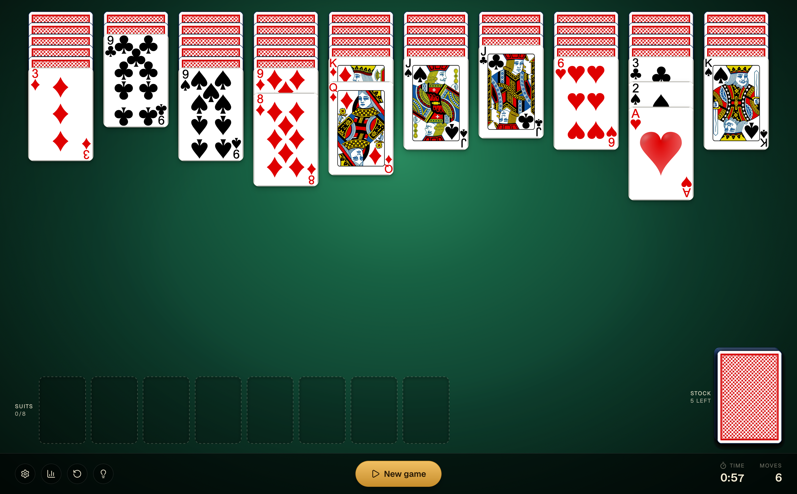

> [!WARNING]
> I fully vibe coded this app using `Opus 4.7 Max Thinking`.
> I have not fully reviewed all of the generated code yet, but I plan to do a proper pass once I have some free time. In the meantime and in honor of Todd Howard let's just say: It just works™.
>
> I do not plan to actively maintain this project, but contributions are welcome. If a change is actually meaningful, I will merge it.

<h1 align="center">Spider Solitaire</h1>

<p align="center">
  A modern Spider Solitaire game built for the browser.
  <br />
  Smooth interactions, polished visuals, customizable cards, and persistent stats.
</p>



<p align="center">
  <a href="#introduction"><strong>Introduction</strong></a>
  ·
  <a href="#features"><strong>Features</strong></a>
  ·
  <a href="#tech-stack"><strong>Tech Stack</strong></a>
  ·
  <a href="#local-development"><strong>Local Development</strong></a>
  ·
  <a href="#native-macos-app"><strong>Native macOS App</strong></a>
</p>

## Introduction

Spider Solitaire is a browser-based take on the classic card game, designed to feel fast, tactile, and satisfying to play on larger screens. The app combines traditional Spider Solitaire rules with a more refined interface, built-in progression tracking, and a flexible visual theme system for cards and feedback.

## Features

- Classic Spider Solitaire gameplay with `1-suit`, `2-suit`, and `4-suit` modes
- Undo support and cycling hints for smoother play sessions
- Persistent local game state so progress and preferences survive refreshes
- Detailed statistics with win rate, averages, and best runs by difficulty
- Customizable card fronts, card backs, and sound settings

## Tech Stack

- Next.js
- React
- TypeScript
- Tailwind CSS
- Zustand
- Motion React (formerly Framer Motion)

## Local Development

Install dependencies and start the development server:

```bash
pnpm install
pnpm dev
```

Then open [http://localhost:3000](http://localhost:3000).

## Native macOS App

The project ships with a [Tauri 2](https://v2.tauri.app) shell in `src-tauri/` that wraps the Next.js static export into a native macOS application.

### Prerequisites

- Xcode Command Line Tools (`xcode-select --install`)
- A Rust toolchain (install with [`rustup`](https://rustup.rs))

### Run in a native window

```bash
pnpm tauri:dev
```

This starts `next dev` on `localhost:3000` and opens a native WebView window pointing at it. Hot reload works the same as in the browser.

### Build a distributable macOS app & DMG

```bash
pnpm tauri:build:mac
```

Artifacts are produced under `src-tauri/target/release/bundle/`:

- `macos/Spider Solitaire.app` — the app bundle
- `dmg/Spider Solitaire_<version>_<arch>.dmg` — a draggable installer

> Note: unsigned builds will be gated by Gatekeeper. For distribution, configure code signing and notarization as described in the [Tauri macOS signing guide](https://v2.tauri.app/distribute/sign/macos/).
